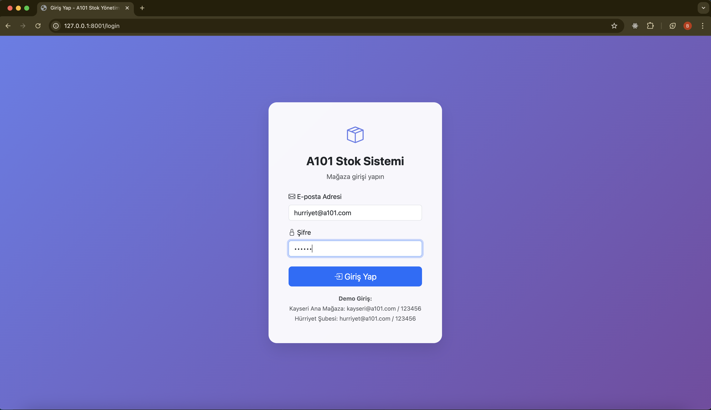
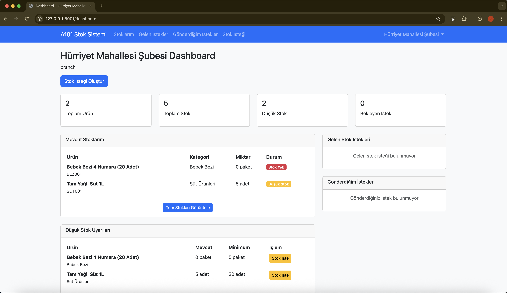
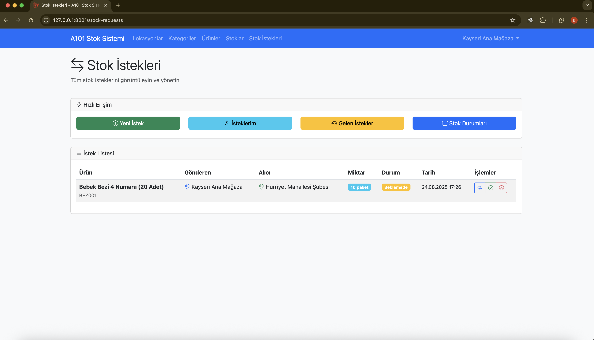
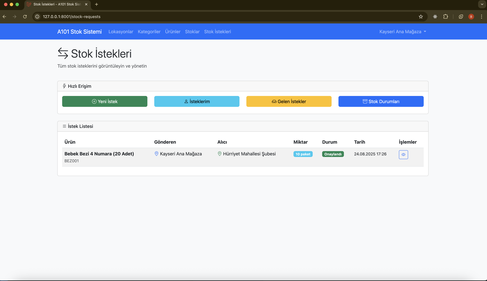

# A101 Stok Yönetim Sistemi

Bu proje, A101 için geliştirilmiş hiyerarşik depo ve stok yönetim sistemidir. Laravel framework kullanılarak Service-Repository mimarisi ile geliştirilmiştir.

## 🚀 Hızlı Başlangıç

### ⚡ 5 Dakikada Çalıştırma
```bash
# 1. Projeyi klonlayın
git clone <repository-url>
cd a101-stock-system

# 2. Bağımlılıkları yükleyin
composer install

# 3. Environment dosyasını oluşturun
cp .env.example .env

# 4. Database ayarlarını yapın (SQLite kullanın)
DB_CONNECTION=sqlite
DB_DATABASE=database/database.sqlite

# 5. Database ve verileri oluşturun
touch database/database.sqlite
php artisan migrate
php artisan db:seed

# 6. Sunucuyu başlatın
php artisan serve

# 7. Tarayıcıda açın
# http://127.0.0.1:8001/login
```

### 🔑 Demo Giriş Bilgileri
- **Kayseri Ana Mağaza**: `kayseri@a101.com` / `123456`
- **Hürriyet Şubesi**: `hurriyet@a101.com` / `123456`

## 🏗️ Sistem Mimarisi

### Hiyerarşik Lokasyon Yapısı
```
Kayseri Ana Depo (Level 0)
├── Kayseri Ana Mağaza (Level 1)
    ├── Melikgazi Şubesi (Level 2)
        └── Hürriyet Mahallesi Şubesi (Level 3)
```

### Teknik Mimari
- **Framework**: Laravel 11
- **Mimari**: Service-Repository Pattern
- **Database**: MySQL/PostgreSQL
- **Frontend**: Bootstrap 5 + Blade Templates

## 🚀 Özellikler

### 📍 Lokasyon Yönetimi
- Hiyerarşik lokasyon yapısı
- Depo, mağaza ve şube tipleri
- Parent-child ilişkileri
- Lokasyon seviye sistemi

### 📦 Ürün Yönetimi
- Kategori bazlı ürün organizasyonu
- SKU ve barkod takibi
- Birim fiyat yönetimi
- Ürün durumu kontrolü

### 📊 Stok Yönetimi
- Lokasyon bazlı stok takibi
- Minimum stok seviyesi uyarıları
- Stok miktarı güncelleme
- Düşük stok raporları

### 🔄 Stok Transfer Sistemi
- Stok transfer istekleri
- Onay/red mekanizması
- Transfer takibi
- Otomatik stok güncelleme

## 📸 Ekran Görüntüleri

### 🔐 Giriş Ekranı


**Giriş Ekranı Özellikleri:**
- Modern ve kullanıcı dostu arayüz
- Gradient arka plan tasarımı
- Demo kullanıcı bilgileri ile kolay test
- Responsive tasarım

**Demo Kullanıcı Bilgileri:**
- **Kayseri Ana Mağaza**: `kayseri@a101.com` / `123456`
- **Hürriyet Şubesi**: `hurriyet@a101.com` / `123456`

### 📊 Dashboard Ekranı


**Dashboard Özellikleri:**
- Lokasyon bazlı kişiselleştirilmiş görünüm
- Hızlı istatistik kartları (Toplam Ürün, Toplam Stok, Düşük Stok, Bekleyen İstek)
- Mevcut stokların anlık durumu
- Düşük stok uyarıları ve hızlı aksiyon butonları
- Gelen ve giden stok istekleri özeti

**Örnek Dashboard Verileri:**
- **Toplam Ürün**: 2 adet
- **Toplam Stok**: 5 adet  
- **Düşük Stok**: 2 adet
- **Bekleyen İstek**: 0 adet

### 📋 Stok İstekleri Yönetimi


**Stok İstekleri Sayfası Özellikleri:**
- Tüm stok isteklerinin merkezi yönetimi
- Hızlı erişim butonları (Yeni İstek, İsteklerim, Gelen İstekler, Stok Durumları)
- Detaylı istek listesi tablosu
- Onay/red işlemleri için modal pencereler
- Durum bazlı renk kodlaması (Beklemede: Sarı, Onaylandı: Yeşil)

**Tablo Sütunları:**
- Ürün (ad + SKU kodu)
- Gönderen Lokasyon
- Alıcı Lokasyon  
- Miktar
- Durum
- Tarih
- İşlemler (Görüntüle, Onayla, Reddet)

### 📦 Stok Yönetimi


**Stok Yönetimi Sayfası Özellikleri:**
- Tüm lokasyonlardaki stok durumlarının genel görünümü
- Gelişmiş filtreleme seçenekleri (Lokasyon, Ürün, Stok Durumu)
- Hızlı aksiyon butonları (Yeni Stok Ekle, Düşük Stoklar, Stokta Olmayanlar)
- Detaylı stok bilgileri (Miktar, Minimum Miktar, Durum)
- Durum bazlı renk kodlaması (Normal: Yeşil, Düşük Stok: Sarı)

**Stok Durumları:**
- **Normal**: Mevcut miktar ≥ Minimum miktar
- **Düşük Stok**: Mevcut miktar < Minimum miktar
- **Stok Yok**: Mevcut miktar = 0

### ➕ Stok İsteği Oluşturma


**Stok İsteği Oluşturma Formu:**
- Basit ve kullanıcı dostu form tasarımı
- Otomatik lokasyon seçimi (giriş yapan kullanıcının lokasyonu)
- Ürün ve miktar seçimi
- Gönderen lokasyon seçimi (kendi lokasyonu hariç)
- İstek notları ekleme
- Stok durumu bilgi kartı

**Form Validasyonu:**
- Zorunlu alanlar kontrolü
- Aynı lokasyondan istek yapma engeli
- Yeterli stok kontrolü
- Miktar limitleri

## 🛠️ Kurulum

### Gereksinimler
- PHP 8.2+
- Composer
- MySQL/PostgreSQL
- Node.js & NPM

### Adımlar

1. **Projeyi klonlayın**
```bash
git clone <repository-url>
cd a101-stock-system
```

2. **Bağımlılıkları yükleyin**
```bash
composer install
npm install
```

3. **Environment dosyasını oluşturun**
```bash
cp .env.example .env
```

4. **Database ayarlarını yapılandırın**
```env
DB_CONNECTION=mysql
DB_HOST=127.0.0.1
DB_PORT=3306
DB_DATABASE=a101_stock_system
DB_USERNAME=root
DB_PASSWORD=
```

5. **Application key oluşturun**
```bash
php artisan key:generate
```

6. **Migration'ları çalıştırın**
```bash
php artisan migrate
```

7. **Örnek verileri ekleyin**
```bash
php artisan db:seed
```

8. **Development server'ı başlatın**
```bash
php artisan serve
```

## 🔐 Varsayılan Kullanıcı

Seeder çalıştırıldıktan sonra aşağıdaki kullanıcı ile giriş yapabilirsiniz:

- **Email**: admin@a101.com
- **Şifre**: password

## 📋 API Endpoints

### Lokasyonlar
- `GET /locations` - Tüm lokasyonları listele
- `POST /locations` - Yeni lokasyon oluştur
- `GET /locations/{id}` - Lokasyon detayı
- `PUT /locations/{id}` - Lokasyon güncelle
- `DELETE /locations/{id}` - Lokasyon sil

### Kategoriler
- `GET /categories` - Tüm kategorileri listele
- `POST /categories` - Yeni kategori oluştur
- `GET /categories/{id}` - Kategori detayı
- `PUT /categories/{id}` - Kategori güncelle
- `DELETE /categories/{id}` - Kategori sil

### Ürünler
- `GET /products` - Tüm ürünleri listele
- `POST /products` - Yeni ürün oluştur
- `GET /products/{id}` - Ürün detayı
- `PUT /products/{id}` - Ürün güncelle
- `DELETE /products/{id}` - Ürün sil
- `GET /products/{id}/stock-levels` - Ürün stok seviyeleri

### Stoklar
- `GET /stocks` - Tüm stokları listele
- `POST /stocks` - Yeni stok oluştur
- `GET /stocks/{id}` - Stok detayı
- `PUT /stocks/{id}` - Stok güncelle
- `DELETE /stocks/{id}` - Stok sil
- `PATCH /stocks/{id}/quantity` - Stok miktarı güncelle

### Stok İstekleri
- `GET /stock-requests` - Tüm istekleri listele
- `POST /stock-requests` - Yeni istek oluştur
- `GET /stock-requests/{id}` - İstek detayı
- `PUT /stock-requests/{id}` - İstek güncelle
- `DELETE /stock-requests/{id}` - İstek sil
- `PATCH /stock-requests/{id}/approve` - İsteği onayla
- `PATCH /stock-requests/{id}/reject` - İsteği reddet

## 🗄️ Veritabanı Yapısı

### Ana Tablolar
- `users` - Kullanıcı bilgileri
- `locations` - Lokasyon bilgileri
- `categories` - Kategori bilgileri
- `products` - Ürün bilgileri
- `stocks` - Stok bilgileri
- `stock_requests` - Stok istekleri
- `stock_transfers` - Stok transferleri

### İlişkiler
- Lokasyonlar arası parent-child ilişkisi
- Kategoriler arası parent-child ilişkisi
- Ürünler ve kategoriler arası ilişki
- Stoklar ve lokasyonlar arası ilişki
- Stok istekleri ve transferler arası ilişki

## 📖 Kullanım Kılavuzu

### 🔐 Sisteme Giriş
1. Tarayıcınızda `http://127.0.0.1:8001/login` adresine gidin
2. Demo kullanıcı bilgilerinden birini kullanın:
   - **Kayseri Ana Mağaza**: `kayseri@a101.com` / `123456`
   - **Hürriyet Şubesi**: `hurriyet@a101.com` / `123456`
3. "Giriş Yap" butonuna tıklayın

### 📊 Dashboard Kullanımı
- Dashboard'da lokasyonunuza özel stok bilgilerini görüntüleyin
- Düşük stok uyarılarına dikkat edin
- Hızlı aksiyon butonlarını kullanarak stok istekleri oluşturun

### 📋 Stok İsteği Oluşturma
1. "Stok İsteği" butonuna tıklayın
2. Ürün seçin ve miktar belirleyin
3. Gönderen lokasyonu seçin (kendi lokasyonunuz hariç)
4. İstek notları ekleyin
5. "İsteği Gönder" butonuna tıklayın

### ✅ Stok İsteği Onaylama/Reddetme
- **Sadece alıcı lokasyon** onaylayabilir/reddedebilir
- **Gönderen lokasyon** kendi isteğini onaylayamaz
- Onaylandığında stok otomatik transfer edilir
- Reddedildiğinde istek iptal edilir

### 📦 Stok Yönetimi
- Tüm lokasyonlardaki stok durumlarını görüntüleyin
- Filtreleme seçeneklerini kullanarak aradığınız ürünleri bulun
- Düşük stok uyarılarını takip edin

## 🧪 Test Senaryoları

### Senaryo 1: Düşük Stok Uyarısı
1. Hürriyet Mahallesi Şubesi'nde süt stoku düşük (5 adet)
2. Minimum stok seviyesi: 20 adet
3. Sistem düşük stok uyarısı verir

### Senaryo 2: Stok Transfer İsteği
1. Hürriyet Mahallesi Şubesi'nde bebek bezi stokta yok
2. Ana depoda 200 adet bebek bezi var
3. Şube ana depodan 50 adet istek yapar
4. Depo onaylar ve transfer gerçekleşir

### Senaryo 3: Hiyerarşik Stok Görüntüleme
1. Kullanıcı ürün stok seviyelerini görüntüler
2. Tüm lokasyonlardaki stok miktarları listelenir
3. Hiyerarşik yapı korunur

## 🔒 Güvenlik Özellikleri

### 🚫 Yetkilendirme Kontrolleri
- **Lokasyon Bazlı Erişim**: Kullanıcılar sadece kendi lokasyonlarındaki verilere erişebilir
- **Stok İsteği Güvenliği**: 
  - Sadece alıcı lokasyon onaylayabilir/reddedebilir
  - Gönderen lokasyon kendi isteğini onaylayamaz
  - Yetkisiz işlemler engellenir
- **Session Güvenliği**: Otomatik logout koruması ve güvenli session yönetimi

### 🛡️ Veri Doğrulama
- **Form Validasyonu**: Tüm kullanıcı girdileri server-side doğrulanır
- **SQL Injection Koruması**: Eloquent ORM kullanılarak güvenli veritabanı işlemleri
- **CSRF Koruması**: Tüm form işlemlerinde CSRF token kontrolü

### 🔐 Kullanıcı Yönetimi
- **Güvenli Giriş**: Şifre hash'leme ve güvenli authentication
- **Lokasyon Bağlantısı**: Her kullanıcı belirli bir lokasyona atanır
- **Oturum Kontrolü**: Middleware ile korumalı rotalar

## 🔧 Geliştirme

### Yeni Özellik Ekleme
1. Model oluştur
2. Migration ekle
3. Controller oluştur
4. Service katmanı ekle
5. Repository interface ve implementasyonu ekle
6. Route tanımla
7. View oluştur

### Test Etme
```bash
php artisan test
```

## 📝 Lisans

Bu proje A101 için geliştirilmiştir.

## 📊 Proje Durumu

### ✅ Tamamlanan Özellikler
- [x] Hiyerarşik lokasyon yönetimi
- [x] Kategori bazlı ürün yönetimi
- [x] Lokasyon bazlı stok takibi
- [x] Stok transfer istekleri sistemi
- [x] Kullanıcı authentication ve authorization
- [x] Dashboard ve raporlama
- [x] Responsive web arayüzü
- [x] Güvenlik kontrolleri ve validasyonlar

### 🔄 Geliştirilmekte Olan Özellikler
- [ ] Gelişmiş raporlama sistemi
- [ ] Email bildirimleri
- [ ] API endpoint'leri
- [ ] Bulk import/export işlemleri

### 🚀 Gelecek Planları
- [ ] Mobile uygulama
- [ ] Real-time stok takibi
- [ ] Barcode/QR kod entegrasyonu
- [ ] Çoklu dil desteği

## 👥 Geliştirici

Bu proje Laravel ve modern web teknolojileri kullanılarak geliştirilmiştir.

## 🆘 Destek

Herhangi bir sorun yaşadığınızda issue açabilir veya geliştirici ile iletişime geçebilirsiniz.
